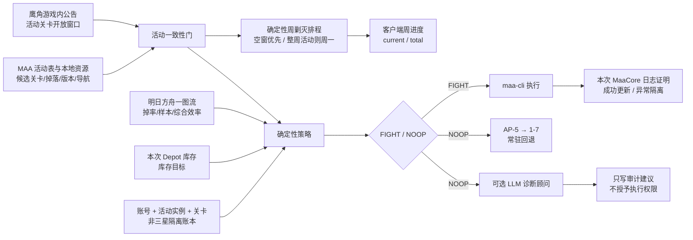

# MAA + Waydroid 自动托管与材料规划

这是一个面向国服官服的 MAA Waydroid 启动器。每天 03:00 和 07:30 两个正式槽位都会各执行一次完整 daily 维护：活动规划、库存扫描或刷图失败只会跳过活动刷图，daily 仍会执行；daily 只有在日志明确证明基建、公招和商店均未开始时才允许重试，一旦任何状态任务开始就失败关闭，绝不整段重放。普通任务奖励从 daily 中隔离，并固定为整轮最后一个 MAA 阶段。

默认还会扫描仓库，根据鹰角官方活动关卡时间、MAA 当前活动与导航能力、明日方舟一图流效率、库存目标以及本地不稳定代理隔离记录，输出确定性的 `FIGHT` 或 `NOOP`。游戏客户端始终是“该关是否保存代理作战”的 ground truth：本地状态未知时允许 MAA 尝试，只有本次日志明确出现非三星结果才会建立更高优先级的负面覆盖。活动关没有合格执行结果时，启动器再按 `AP-5`、`1-7` 顺序刷取。所有实际理智作战都允许使用 MaaCore 识别为两天内到期的药，普通药和源石仍禁用。

每周剿灭也由确定性程序单独规划：优先选择没有活动关卡冲突的窗口；活动覆盖整周时固定在周一游戏日执行。活动日历变化后会重新计算，错过计划窗口会补做，LLM 不参与剿灭排程、执行或完成判断。

当前完整自动链路只支持 `Official` 国服官服。B 服和国际服没有接入等价的官方活动确认与启动器包名校验，因此配置层会拒绝启用，避免表面可运行、实际刷错服。

## 架构与授权边界



各输入只承担单一职责：

| 输入 | 用途 | 不能授予的权限 |
|---|---|---|
| 鹰角游戏内公告 | 确认明确标注的“活动关卡开启/开放时间” | 不提供关卡代码、掉落或效率；商店和总活动时间不能代替关卡时间 |
| MAA `StageActivityV2` 与本地资源 | 提供活动候选关、目标材料、最低 MaaCore 版本，并确认本地资源能导航 | 不决定哪一关最值得刷 |
| 明日方舟一图流 | 提供关卡掉率、样本量、期望理智和综合效率 | 不证明活动已经开放，也不能加入 MAA 候选集之外的关卡 |
| 本次 Depot 扫描 | 提供当前会话的库存观测；经典材料按确定性合成链换算蓝材料等价库存 | 未识别到的目标蓝材料是“未知”；下级材料缺失只是不计入，绝不虚构库存 |
| 能力账本 | 保存三星成功审计和本活动实例中明确观测到的非三星隔离 | 不能替代客户端判断是否保存代理；缺少本地记录不是拒绝理由 |
| LLM 顾问 | 诊断来源冲突、结构变化和可能的映射问题 | 不能把 `NOOP` 改成 `FIGHT`，不能登记代理能力 |

外部来源仅允许预设 HTTPS 域名。响应有大小限制、严格 JSON/结构校验、重复键和非有限数拒绝、请求体身份、SHA-256、条件请求与原子缓存；网络失败时只接受 freshness 范围内且哈希仍一致的缓存。官方公告和 MAA 的活动名称、起止时间必须同时匹配，且当前时刻必须确实位于两者窗口内。

## 目录

- `bin/maa`：使用项目隔离目录的 maa-cli 入口。
- `bin/maa-planner`：来源同步、库存解析、规划和能力账本 CLI。
- `bin/maa-host`：统一宿主入口；`run` 转入完整启动器。
- `scripts/run-daily.sh`：Waydroid、自动刷图和 daily 的一键编排。
- `maa_planner/`：来源适配、确定性策略、库存、能力证明、缓存及 LLM 顾问边界。
- `config/farming.toml`：活动、freshness、选关和库存目标策略。
- `config/material-recipes.toml`：严格校验的经典 T1→T2→T3 合成链，只用于蓝材料等价库存计算，不执行合成。
- `config/fight-decision.jq`：启动器对规划器 `FIGHT` JSON 的独立执行契约。
- `config/annihilation-decision.jq`：周剿灭排程的独立执行契约。
- `config/tasks/sanity-fight.toml`：动态关卡、两天临期药无限额、普通药和源石禁用的实际 Fight。
- `config/tasks/verify-fight.toml`：兼容审计模式的一次三星验证，随后仍转入无限额 Fight。
- `config/tasks/annihilation.toml`：每次只执行一笔、随后核对客户端周进度的剿灭事务。
- `config/tasks/depot.toml`：把原生 StartUp 与当次仓库扫描合在同一个 MaaCore 任务链中。
- `config/tasks/proxy-preflight.toml`：在同一个 MaaCore 任务链中先以零次 Fight 导航，再只读识别当前关卡是否已勾选代理作战。
- `config/tasks/daily.toml`：每轮只执行一次的基建、公招和信用商店维护；基建拆成普通设施换班和受保护宿舍恢复两个原生 Infrast 阶段；公招先以 09:00 自动确认普通 3–5 星并保护 `支援机械`，随后用独立的原生 Recruit 阶段以 03:50 自动确认小车；若同槽有保证 4/5 星则仍优先高星，只有 6 星留给人工确认；不会在中途关闭启动器持有的 Waydroid 会话。
- `config/infrast/protected-dorm.json`：四间宿舍的官方自定义排班；没有任何具名干员，只允许从游戏“未进驻”筛选结果自动补位。
- `config/tasks/award-only.toml`：固定放在整轮最后的普通任务奖励领取；同时供轻量 E2E 复用，不进入基建、公招、商店、邮件或战斗。
- `config/profiles/waydroid.toml`：Waydroid 连接配置。
- `config/host.env`：Waydroid profile、`MAA_FARM_MODE` 和运行策略；统一入口固定执行 `daily`。
- `scripts/update-maa-runtime.sh`：隔离安装 stable Core 和全部资源，验证整套候选后原子提升为 live；旧资源脚本仅保留为兼容入口。
- `systemd/`：用户级 service/timer；06:30 安全更新完整 MAA runtime，03:00 槽位会在 04:00 前强制清理，07:30 完整链路预留 10 小时上限。
- `var/`：MaaCore、资源、来源缓存、决策、日志和运行状态，不提交 Git。

## 测试策略

仓库刻意只保留 8 条高层需求测试，而不为每个内部 helper 维护大量重复单元测试。它们覆盖：无人登录的 service 与任务边界、单进程 Depot 和单次来源刷新、来源和库存共同授权刷图、不安全输入 fail closed、剿灭可跨多轮且不阻塞普通刷图、只有本轮完整客户端证据才能改变能力状态、Depot/HTTP 缓存完整性、LLM 只读隔离，以及 Core＋资源整代原子更新、generation receipt 与回滚。前 7 条集中在 `tests/test_requirements.py`，更新事务场景位于 `tests/test_runtime_updater.py`。

```bash
PYTHONDONTWRITEBYTECODE=1 python -m unittest discover -s tests -v
```

这组测试完全在本地运行；更新器场景使用临时目录、假 Maa 和本地 Git 仓库，不启动 MaaCore、ADB、Waydroid 或游戏。真实设备 E2E 另用 `award-only.toml`，只在设备空闲时手工执行。

## 初始化

```bash
./scripts/bootstrap.sh
sudo ./scripts/install-network-fix.sh
./bin/maa-host install-core
./bin/maa-host doctor
./bin/maa-planner sync
```

`bootstrap.sh` 安装项目本地的 maa-cli；在 Arch 上会按需安装 `android-tools`、`gamescope` 和 `jq`。`install-network-fix.sh` 一次性写入 Docker 原生的 `ip-forward-no-drop` 配置，并把当前 `FORWARD` 策略切为 `ACCEPT`；它不会重启 Docker。以后 Docker 启动时不会再把转发默认策略改回 `DROP`，启动器本身只检查联网，不再动态提权改 iptables。这个 Docker 选项是宿主机级配置，适合当前单网卡的可信家庭 LAN；如果以后把机器用作多网卡/VPN 路由器，应重新审查全局转发策略。Waydroid 需先完成 `waydroid init`，并在其中安装、登录国服官服明日方舟。

`doctor` 只检查依赖、无人登录条件和已提升 runtime 的 generation receipt，不再重复启动 7 个 MaaCore dry-run。所有 Core/资源/任务兼容 dry-run 只属于 `install-core`/每日 06:30 的隔离更新事务。

第一次连接时运行：

```bash
waydroid show-full-ui
waydroid adb connect
./bin/maa-host probe
```

Android 弹出调试授权时勾选“始终允许”。`probe` 应确认 ADB 已授权并找到官服包。

## 配置库存策略

默认不需要逐个填写活动材料：`policy.default_target = 200` 会动态应用到当前活动的每一种可刷蓝材料。这里的 `200` 始终是 T3 蓝材料单位，不是“每一种稀有度各留 200”。换活动后，材料集合随 MAA 活动表自动变化，求解器继续以 200 蓝材料等价库存为目标读取 Depot 并排序。

对存在下级合成链的六类经典材料，等价库存按下面的整数公式计算：

```text
蓝材料等价数 = 实存 T3 + floor((实存 T2 + floor(实存 T1 / 3)) / T2合成T3所需数)
```

固源岩组每个需要 5 个固源岩；糖组、聚酸酯组、异铁组、酮凝集组和全新装置每个需要 4 个对应 T2 材料。T1 合成 T2 均为 3:1。例如 150 个固源岩组、245 个固源岩和 15 个源岩会按 `150 + floor((245 + floor(15 / 3)) / 5) = 200` 计算。只计确定性整数组合，不计加工站副产物，也不会为了规划而实际合成、消耗龙门币或占用加工站。没有配置下级链的新材料维持直接 T3 计数。

合成链单独保存在 `config/material-recipes.toml`，配置 schema、字段、比例、重复物品 ID 都会严格校验；运行时还会把其中的物品 ID、中文名和 `MATERIAL` 类型与当前整代 MAA `item_index.json` 交叉核对。资源更新若改变了物品身份会 fail closed，不能静默把库存算到错误材料上。目标 T3 未被 Depot 识别时仍视为未知并停止自动选关；未识别到的 T1/T2 只贡献零个可合成量，因此最多导致保守地多刷，不会虚增蓝材料。

只有某个材料需要不同目标时，才添加 `[[targets]]` 覆盖。材料 ID 可从同步后的 `var/state/planner/latest-sources.json` 中查看：

```bash
jq '.activities[] | {name, start, end, instance_id, stages}' \
  var/state/planner/latest-sources.json
```

示例：

```toml
[policy]
when_satisfied = "best_event"

[[targets]]
item_id = "30053"
low = 30
target = 80
reserved = 10
priority = 1.5
```

- `reserved`：从蓝材料等价库存中扣除，不计入可用库存。
- `low`：有效库存低于该值时进入最高优先级“硬下限”桶。
- `target`：希望在预留量之外维持的库存。
- `priority`：同一优先级桶内的权重。
- 未单独配置的当期活动材料：自动使用 `low = 0`、`target = 200`、`reserved = 0`、`priority = 1`。
- `when_satisfied = "best_event"`：所有当期材料达到各自目标后，继续刷一图流综合效率最高的合格活动关。
- `when_satisfied = "skip"`：所有目标满足后返回 `NOOP`。

选择顺序为：低于硬下限、尚有目标缺口、活动最佳效率。目标桶内按优先级、归一化缺口和期望理智评分，再用综合效率、样本量和关卡码稳定打破平局。自动模式强制 `medicine = 0`、`medicine_expire_days = 2`、`stone = 0`：不会吃普通药或碎石，但会把 MaaCore 两天到期桶内的药全部用于刷图。

临期药启用时不向 MaaCore 下发 `drops` 或 `times` 停止条件，避免库存刚达到 200 就提前停止、留下即将过期的药。库存目标仍决定本轮优先刷哪一种材料；下次运行重新扫描 Depot 后再求解。MaaCore 内部对临期药确认使用 9999 次安全上限，因此这里的“无限”是相对于实际可持有数量；两天是游戏 UI 的整日到期桶，不是逐秒倒计时的精确 48 小时。

统一启动器会把 `MAA_CONFIG_DIR` 固定到项目的 `config/`，并在运行前严格解析实际的 `sanity-fight`、`verify-fight` 与 `annihilation` TOML。整数类型、参数集合或数值只要发生漂移（例如普通药、源石、早停次数被打开），本轮所有理智消费都会 fail closed。正常材料 Fight 没有数量上限，但有四小时防卡死 watchdog；若真实持药量极端到四小时仍未消耗完，下个定时槽会继续，而不是无限挂住设备。

Depot 中缺失目标材料不会被理解为零。例如 OCR 没看到当前活动可刷的任一目标物品时，本轮所有候选都会以 `INVENTORY_REQUIRED_ITEM_MISSING` 关闭，避免绕过一个未知但可能紧缺的目标去刷另一关。

### 基建换班

“不进入训练室”并不等于“不会把训练室干员拉走”：MAA 的默认宿舍换班会从全体干员中挑选低心情对象，若没有启用游戏侧“未进驻”筛选，仍可能在宿舍界面把训练室中的干员改派出去。

因此 `daily.toml` 把基建固定拆成两个顺序执行的官方 Infrast 任务。第一段使用默认算法处理制造站、贸易站、控制中枢、发电站、会客室和办公室，白名单同时排除 `Dorm` 与 `Training`；它先把普通设施中需要休息的干员换下，使其成为未进驻状态。第二段使用 `mode = 10000` 的官方自定义排班，只进入 `Dorm`，强制 `dorm_notstationed_enabled = true`，并读取 `config/infrast/protected-dorm.json` 中四个“空具名列表 + autofill”房间。宿舍因此只能选择第一段换下来的未进驻干员，仍进驻训练室或其他设施的人不在候选集合内。

运行前的静态契约要求上述两段的顺序、模式、设施集合、未进驻开关和排班 JSON 全部精确匹配；排班 JSON 一旦增加具名干员、其他设施或少于/多于四间宿舍就会 fail closed。运行后的日志还必须证明恰有两个 Infrast 完成、四间宿舍都被处理且从未出现 `EnterFacility Training`，否则整次 daily 不计为成功。

### 基建无人机

启动器会在 daily 前执行一次只读 Depot 扫描，并按赤金（物品 ID `3003`）库存确定 MAA 的无人机目标：少于 `150` 时选择 `PureGold` 加速赤金制造站，达到或超过 `150` 时选择 `Money` 加速贸易站。阈值由 `config/host.env` 的 `MAA_PURE_GOLD_DRONE_THRESHOLD` 配置。

这个选择完全由确定性程序完成，不依赖 LLM。每轮最多执行一次 Depot：07:30 在 daily 前取得的同一快照既决定无人机，也供稍后的材料关求解器复用；因此 daily 期间由基建或信用商店带来的库存变化要到下一轮才会反映。首次前置启动失败会重试一次；若两次都失败且尚未执行 Depot，daily 仍照常运行，并把本轮唯一的 Depot 机会留到材料规划前，此时无人机安全回退为 `_NotUse`。若唯一一次 Depot 已执行但扫描不完整、赤金未识别、快照过期或账号不匹配，则不会二次扫描或猜测库存。

## 每周剿灭排程

游戏周按国服规则计算：先把当前时刻转换到 `Asia/Shanghai`，减去四小时得到游戏日，再取该游戏日所在星期一作为周键。因此周一 03:00 仍属于上周星期日，周一 07:30 才属于新周。

规划器把本周 MAA 活动窗口与鹰角公告窗口按和材料规划相同的名称、时间及容差规则配对，并用两者的保守并集判断活动占用。这个活动日历有独立抓取路径，不访问一图流；因此材料效率接口故障不会把剿灭排程误降级为“活动来源不确定”。每次运行都会重新同步和计算：

1. 当前实际执行窗口没有活动冲突时立即剿灭。
2. 当前有活动、后面存在安全空窗时等待最早的 07:30 空窗。
3. 活动关卡覆盖整周时，计划时间固定为周一 07:30；周一错过或失败则下一次运行补做。
4. 双来源缺失或冲突不会被伪装成“无活动”，而是走周一保守回退；旧周最后一小时会重新评估，但不足以容纳完整 30 分钟事务时绝不开战。

执行时每个 `annihilation` task 只进行一次单倍事务，并使用 MAA 原生 `stage = "Annihilation"` 路径：先尝试 PRTS“全权委托”卡；没有卡时回退到已保存的普通代理并实际跑完整场，而不是把“无卡”当成失败或跳过剿灭。因此每笔始终预留完整 30 分钟，不能按有代理卡时的短耗时缩小预算。下一次事务会重新检查客户端状态，最多连续十次。一次体力不足以打满周奖励并不是异常：已结算的 `progress` 会跨 service 保留，本轮体力耗尽后停止，后续定时任务继续补；玩家手动打出的客户端进度也以随后读到的周计数为准。剿灭不吃普通药、不碎石，只允许使用两天内到期的理智药。规划决策同时签出绝对 `execute_before`：执行器在每笔事务前重查剩余时间，并为 30 秒强制清理预留余量，因此“无活动的两小时窗口”不会扩张成十笔各 30 分钟。每次结算从本轮新增 MaaCore 日志读取客户端 OCR 的 `annihilation_weekly_process = [current, total]`；只有同一 `uuid + taskid` 随后正常完成，且 `current >= total > 0`，才原子登记本周 `complete`。星级、命令退出 0 或本地自行累计次数都不能替代周上限证明。MaaCore 的星级 OCR 为 `0`（未知）时仍接受独立的周进度；明确为 `2` 时先记进度，再把本游戏周标记为 `BLOCKED`，后续运行不会继续撞不稳定代理。

若玩家已经手动打满，本地不一定能从随后消失的剿灭入口取得周进度证明；相同现象也可能来自导航或模板识别失败。启动器不会把两者混为一谈：只有客户端回报的周上限强证明才持久化 `complete`，没有证明就把周状态保留为未知并结束本轮剿灭阶段。无论是已确认满额、状态未知还是剿灭事务失败，剿灭都不是材料刷图的门禁，主流程会继续复用或取得本轮唯一的 Depot 快照，并进行材料规划与普通刷关；未知状态只会让后续定时任务再次检查。周状态按 `client + account + week_start_game_day` 隔离，跨周一 04:00 的事务拒绝落盘。MaaCore 日志游标绑定设备号、inode 与字节偏移，日志读取失败、轮转或缩短都不能回收旧证明。状态位于 `var/state/planner/annihilation.json`，整个排程和记账路径不调用 LLM。

## 客户端代理判定与不稳定隔离

新活动的 `activity_instance` 由客户端、活动键、名称和起止窗口共同生成。即使复刻沿用了相同关卡码，旧活动的能力证明也不会继承。

正常自动运行不需要指定关卡，关卡始终由同一个确定性求解器决定。求解器按库存缺口和一图流效率给出有序候选，启动器对每个候选执行一个确定性 `proxy-preflight`：同一个 MaaCore 进程中的 `Fight(times = 0, series = -1)` 只导航并尝试勾选代理，在任何开始行动点击前因零次上限停止；紧随其后的 `UsePrtsSuccessCheck` 再只读检查同一画面。日志必须依次证明一次 Fight 和一次 Custom 均完成，且没有对应 Error，才执行独立的真实 Fight。这样既保留客户端 ground truth，也不再为一次代理检查重复连接两次 Core。

`--verify-proxy` 仅保留为兼容审计模式：候选选择规则完全相同，每个候选先最多运行一次验证；验证成功后仍把该关交给无 `times/drops` 上限的正常 Fight，以免审计模式留下两天内到期药。两个阶段都不吃普通药、不碎石，并使用原生 `medicine_expire_days = 2` 参数。它不再是正常自动运行的前置条件：

```bash
./scripts/run-daily.sh --verify-proxy
./bin/maa-planner capabilities
```

只有一次 Fight 开始以后新增的 MaaCore 日志中同时出现：

1. 目标关卡的 `StageDrops`；
2. `stars = 3`；
3. 同一 `uuid + taskid` 的 Fight 完成事件；
4. 同一执行中没有后续二星、错关、错误或停止；

才会为当前活动实例登记 `verified` 作为审计信息，但这个正面记录不参与执行授权。反过来，只有日志明确给出目标关 `stars = 2`，启动器才登记 `proxy-non-three-star` 并在该活动实例内隔离该关；`stars = 0` 是星级模板 OCR 未识别，`1` 不是当前 Core 会产生的结果，两者和普通命令失败、未找到代理按钮、导航失败、日志缺失一样都保持未知，不会隔离。

若是完全陌生的新活动，活动数据、官方窗口、导航和库存检查仍须全部通过。通过后可以零理智探测候选，但只会真实执行客户端确认已有代理的关卡；没有可用代理时不会开始陌生活动战斗，随后以同样的 preflight 依次检查 `AP-5`、`1-7` 并继续清日常，也不会把未知状态永久拉黑。

`config/farming.toml` 的 `account` 是本地隔离状态命名空间，目前无法从游戏自动证明实际登录 UID。Waydroid 内切换账号时必须修改 `account`，避免把某账号、某活动实例的非三星隔离错误套用到另一个账号。

## 每次运行

默认自动规划并保证本次所处游戏日完成 daily：

```bash
./scripts/run-daily.sh
# 等价入口，也是 systemd service 使用的命令
./bin/maa-host run
```

默认顺序如下：

1. 用一次纯本地检查核对静态安全契约和 06:30 更新器写入的 runtime generation receipt；不会启动 MaaCore。receipt 与 live Core、资源、API cache 或受管任务配置不一致时整轮失败关闭。
2. 07:30 槽用一个原生 `startup = true` 的 MAA task 同时启动游戏并执行本轮唯一的只读 Depot 扫描，以赤金 `150` 阈值确定本轮无人机目标；不再为 Depot 单独启动一个 StartUp Core。03:00 保护槽跳过这个前置步骤并禁用无人机，优先把时间留给旧游戏日。
3. 两个槽都运行同一份完整 daily（基建、普通公招、小车公招、信用商店）；只有首次日志非空且完全没有状态任务标记时才重试。任一 `Infrast`、`Recruit`、`Mall` 或设施进入标记出现后都禁止重放。
4. 每轮只联网刷新一次规划来源：03:00 只刷新剿灭和活动共同依赖的鹰角公告＋MAA 活动日历，并复用上一轮仍新鲜的一图流缓存；07:30 刷新完整来源。live MAA 资源仍只由独立的受控更新器写入。
5. 用本轮缓存离线计算本周剿灭窗口；到期时按单次代理事务执行，逐次读取客户端周进度，满额才登记完成。来源刷新失败不会在这个阶段再次轰炸同一端点。
6. 材料规划复用本轮已有的 Depot 快照；03:00 槽才在此执行本轮唯一一次扫描。已尝试但失败的 Depot 不会在同一轮重复；决策同样只离线校验并复用第 4 步缓存，不做第二轮网络刷新。
7. 仅当 JSON 为合法 `FIGHT` 且启动器二次校验所有有序候选的关卡码、活动实例、材料及两天临期药参数后，逐关执行零次战斗导航与客户端代理勾选检查。
8. 只有客户端 preflight 成功才执行真实 Fight；没有可用代理或普通执行失败时尝试下一候选，只有本次日志明确出现目标关非三星结果才隔离该活动实例的关卡。
9. 所有活动候选均没有新鲜三星完成证明时，依次尝试 `AP-5`、`1-7`；只有本次 MaaCore 日志证明对应关卡三星完成才停止回退。这样 AP-5 的开放判断来自实际 MAA 导航，也能兼容临时资源本全开放。
10. 无论前面的可选刷图是否成功，最后只运行独立的 `award-only`，领取普通任务奖励；它不能进入基建、公招、商店、邮件或战斗。

整轮编排只启动并持有一个 Waydroid 会话。各条 maa-cli 子命令复用同一个运行中的 Waydroid/ADB 设备；daily 和 award-only 都不负责关闭会话，启动器只在全部阶段结束或异常退出时统一清理一次。

启动器不会只凭 maa-cli 的退出码宣布成功：daily 日志必须恰有两次 `Infrast Start/Completed`、四次 `EnterFacility Dorm #`、两次 `Recruit Completed`，不得出现 `EnterFacility Training`，并包含 `Mall Completed` 与 `AllTasksCompleted`；最后的 award-only 独立日志必须包含 `Award Completed` 与 `AllTasksCompleted`，且不得出现 `Infrast`、`Recruit`、`Mall`、`Depot` 或 `Fight` 的开始/完成标记。统一入口固定使用 `INFO` 日志级别以保留这些证据。

游戏日统一定义为 `Asia/Shanghai` 当前时刻减四小时后的日期。定时槽的截止时间保证正常运行不会跨过 04:00；如果异常跨界，启动器会失败关闭，而不会在同一个 service 中再次执行基建、公招或商店。

不刷理智、绕过活动来源同步和材料规划；仍会先读 Depot，以确定无人机应该加速赤金还是贸易站：

```bash
./scripts/run-daily.sh --no-farm
# 或
./scripts/run-daily.sh --farm off
```

其他入口：

```bash
# 只核对静态契约和持久化 generation receipt；不启动 MaaCore 或设备
./scripts/run-daily.sh --dry-run

# 只检查 Waydroid、ADB、720p 和网络，不运行游戏任务
./scripts/run-daily.sh --check-device

# 强制验证无人登录时使用的 headless surface
./scripts/run-daily.sh --display-mode headless --check-device

# 开发期轻量 E2E：只领取普通任务奖励，不进入基建、公招、商店、邮件或战斗
./scripts/run-daily.sh --display-mode headless --e2e-award

# 兼容审计模式：让求解器选择候选，每关最多执行一次；最后仅领取奖励
./scripts/run-daily.sh --verify-proxy

# 仅用于诊断的人工关卡覆盖；无论它是否成功，最后仅领取奖励
./scripts/run-daily.sh --stage AT-8

# 仅在明确需要绕过统一编排时直跑旧式 MAA task
./bin/maa-host raw-run [task] [profile]
```

设备、ADB、官服包或网络本身不可用时没有执行 daily 的基础条件，因此这类错误仍会让启动器失败。daily 在状态任务开始后缺少完整证明时会立即返回非零，避免重复改变游戏状态，也避免定时器把未清日常误报为成功。

## Fail-closed 条件

以下任一情况都会禁止自动活动 Fight；自动模式随后尝试 `AP-5`、`1-7`，并且不会阻止 daily：

- 当前没有 MAA 活动，或进入活动结束前安全边界。
- 官方公告没有明确的关卡窗口，当前时刻不在官方窗口内，或官方与 MAA 时间冲突。
- 必需来源过期、不可用、结构异常、请求身份变化或缓存哈希失败。
- MAA 活动缺少合法最低版本，MaaCore 版本不足，或本地资源不能导航关卡。
- 一图流没有对应关卡/材料、样本不足，或数值异常。
- Depot 不完整、过期、属于其他命名空间，或目标材料未被观察到。
- 关卡已在本账号命名空间、本活动实例中被明确的非三星结果隔离。
- 零次战斗导航或客户端 `UsePrtsSuccessCheck` 未确认代理已勾选。
- 决策 JSON 的 schema、关卡码、活动实例或执行参数未通过启动器二次校验。

## Planner 命令与审计状态

```bash
./bin/maa-planner validate-service-readiness
./bin/maa-planner validate-runtime-contracts
./bin/maa-planner sync
./bin/maa-planner sync-calendar
./bin/maa-planner plan --offline
./bin/maa-planner plan-annihilation --offline
./bin/maa-planner capabilities
./bin/maa-planner quarantine --stage AT-8 --reason manual-investigation
```

自定义配置是全局参数，必须放在子命令前：

```bash
./bin/maa-planner --config config/farming.toml plan --offline
```

主要状态：

- `var/state/planner/latest-sources.json`：最近来源快照、窗口、效率和哈希证据。
- `var/state/planner/latest-activity-calendar.json`：剿灭独立使用的 MAA＋鹰角活动日历及哈希证据，不依赖一图流。
- `var/state/planner/inventory.json`：最近完整 Depot 快照。
- `var/state/planner/capabilities.json`：账号、活动实例、关卡维度的三星审计和非三星隔离账本。
- `var/state/planner/annihilation.json`：客户端观测到的本游戏周剿灭进度/满额证明。
- `var/state/planner/latest-annihilation-decision.json` 与 `annihilation-decisions/`：当前及历史剿灭排程证据。
- `var/state/planner/latest-decision.json`：手工规划的最近决策。
- `var/state/planner/launcher-<timestamp>.json`：启动器本次使用的决策。
- `var/state/planner/decisions/`：按生成时间归档的历史决策。
- `var/state/planner/latest-advisor-probe.json` 与 `advisor-probes/`：最近一次及历史 LLM 真实连通性探针；探针不启动 Waydroid 或游戏。
- `var/state/runtime/maa-resource.json`：最近候选/当前 Core 版本、资源提交、组合选择、验证结果、generation fingerprint 及回滚原因。
- `var/cache/planner/http/`：响应正文和带请求身份、ETag、时间及 SHA-256 的 metadata。
- `var/state/host/*-pre-daily-depot.log`：07:30 在 daily 前取得、同时用于无人机和材料规划的本轮唯一 Depot 日志。
- `var/state/host/*-e2e-award.log`：只领取普通任务奖励的轻量 E2E 探针日志；必须仅含 `Award Completed` 与总链完成证明。
- `var/state/host/*-award-final.log`：正式 service 最后的同一 Award-only 任务日志，同样禁止出现基建、公招、商店、邮件或战斗任务。
- `var/state/host/*-depot.log`：03:00 延后取得的本轮唯一 Depot 日志；`*-proxy-preflight-<stage>.log`、`*-annihilation-*.log`、`*-farm-<stage>.log`、`*-daily.log` 分别记录单进程客户端代理 preflight、剿灭、各候选刷图和日常执行。
- `var/state/debug/asst.log`：用于验证本次三星完成的 MaaCore 核心日志。

安全拒绝是正常业务结果，因此 `plan` 写入 `NOOP` 时通常仍退出 0；调用方必须读取 JSON 的 `decision` 和 `reason`。`sync`、`validate-config` 等操作失败才使用非零退出码。

## MAA Core 与资源一致性

`config/cli.toml` 固定 `resource.auto_update = false`，因为 maa-cli 的 Git 热更新会在 MAA 命令启动前直接改写 live overlay，无法先证明新资源与当前稳定 MaaCore 兼容。maa-cli 0.7.5 还会在每个任务前检查 API `tasks.json` 并最后覆盖同名 Core 任务；正式运行因此使用 `var/data/cache` 中已验证的快照，并把该快照的新鲜期设为 100 年，普通任务只装载而不联网换版。`var/cache/maa-runtime` 是指向该目录的兼容链接。项目的 `bin/maa` 会拒绝配置漂回 Git 自动更新，也会拒绝对 live 直接执行 `maa hot-update`、`install` 或 `update`。

这里并不停止 Core 或资源更新，而是把它们合并到 `./bin/maa-host runtime-update`。更新器先在 `var/cache/maa-runtime-candidate.*` 复制当前代际，再用 maa-cli 安装最新 stable MaaCore 及其配套基础资源，同时取得最新 MaaResource 和 API tasks/活动表。候选按“最新 overlay/当前 overlay/仅基础资源”和“最新 API cache/当前 API cache”从新到旧组合，以候选 Core 对 daily、Award-only、剿灭、Depot、单进程代理 preflight 及两种 Fight 逐一 dry-run，并在提升前用候选代际实际生效的 `item_index.json` 核对蓝材料配方身份；选择第一个完整通过的组合。

Core 库、Core 基础资源、Git overlay 和 API cache 全部位于同一个 `var/data` 代际。通过候选使用 Linux 原子目录交换一次发布，随后再次验证；失败则用同一种原子交换恢复上一代。上一份完整 runtime 保存在 `var/cache/MaaRuntime.previous`。候选失败或网络不可用时不会接触 live；只要 live 自检仍通过，游戏 service 继续使用它。

每次完整验证成功后，更新器把 schema 3 generation receipt 原子写入 `var/state/runtime/maa-resource.json`。它密封 `var/data` 的文件身份/大小/时间 metadata、MaaCore 主库 SHA-256、API tasks 与活动表 SHA-256，以及真正参与候选 dry-run 的 `cli.toml`、任务、profile 和受保护宿舍配置摘要。规划目标、阈值等运行策略不被不必要地钉死，仍由每轮静态契约独立校验。03:00、07:30 和轻量 Award E2E 只重算并比较这份 receipt，再执行一次静态契约检查；它们不再逐项启动 MaaCore dry-run。更新器会在交换 live 前先写 `status = "promoting"`，因此中途掉电也不会让新旧代际被误认成已验证。旧 schema 2 receipt 只作为现有 live 的只读迁移桥接：必须匹配两份 hot-cache 哈希和全部静态契约；下一次 06:30 成功验证后自然升级为完整 schema 3。

06:30 `maa-waydroid-runtime-update.timer` 每天同时检查 stable Core 与官方 MaaResource `main`，所以不会因为资源暂时要求更高 Core 而永久钉死旧版。`./bin/maa-host install-core`、`update` 和 `runtime-update` 都进入同一个事务式更新器；`resource-update` 只是旧命令的兼容别名。手工执行 `maa-planner sync` 也只调用这个入口；正式游戏 service 已持有全局锁，所以仅刷新 HTTP 规划来源，不会在任务中途改 runtime。状态证据位于 `var/state/runtime/maa-resource.json`。

## LLM 诊断兜底

活动更新、时间解析、双来源一致性、周剿灭排程与完成证明、库存、效率计算、选关、参数校验和代理能力判断全部是确定性 Python/Shell 程序，不需要 LLM 才能运行。当前配置已启用只读 Codex 顾问；禁用它只需把 `[agent].enabled` 改为 `false`。

LLM 仅是诊断旁路，不在执行授权路径中。只有确定性规划已经得到 `NOOP`，并且原因指向上游来源不可用、schema 变化、官方/MAA 活动冲突、MAA 导航或一图流关卡映射缺失时，顾问才会从 stdin 收到该决策和证据。没有活动、处于结束安全边界、库存不可用、目标已满足、客户端没有代理或本地隔离等预期业务结果不会调用 LLM。stdout 必须是一个受限 JSON：

```json
{
  "schema_version": 1,
  "classification": "stage_mapping",
  "confidence": 0.8,
  "summary": "诊断说明",
  "mappings": [
    {
      "stage_code": "AT-8",
      "yituliu_stage_id": "act44side_08",
      "reason": "映射依据"
    }
  ],
  "evidence_refs": ["引用的证据路径或字段"]
}
```

`classification` 只能是 `stage_mapping`、`source_schema`、`source_conflict` 或 `unknown`；建议中的关卡必须来自确定性候选集。每次 `plan` 都会写入 `decision.evidence.agent`，用 `disabled`、`not_applicable`、`success`、`error` 或 `configuration_unavailable` 明确说明是否启用、是否符合调用条件、是否真的调用。成功结果另写入 `agent_advice`，失败详情写入 `agent_error`，两者都绝不改变本次 `NOOP`。

需要区分“本次规划不适用 LLM”和“LLM 没有接通”时，运行显式探针：

```bash
./bin/maa-host advisor-check
jq . var/state/planner/latest-advisor-probe.json
```

探针只向已配置的 adapter 发送一个带 `game_action_authorized=false` 的合成来源故障，不读取真实游戏状态、不启动 Waydroid/MAA，也不修改基建或任何游戏数据；结果原子写入最近状态并按时间归档。`doctor` 只检查 adapter、Codex 版本和本地登录态，不自动发起模型请求。`config/host.env` 用 `${HOME}/.local/bin/codex` 固定无人登录时的可执行文件解析，不依赖交互 shell 的 PATH。

随项目提供的 adapter 使用 Codex `exec` 的显式 stdin prompt、ephemeral session、只读 sandbox 和空临时工作区，关闭执行/浏览器/桌面/plugin/subagent 工具，并在返回后再次校验结构化 JSON；超时、非法输出或虚构关卡均按失败关闭。

## systemd 定时托管

三个 timer 固定按国服时区 `Asia/Shanghai` 运行。`06:30` 只做隔离的 Core/资源候选验证，不启动 Waydroid；游戏任务在每天 `03:00` 与 `07:30` 运行。两次游戏任务都调用同一个启动器和同一份完整 `daily.toml`，各执行受保护的两段基建、两段公招和信用商店，再规划剿灭和材料刷图，最后只执行 Award-only。明日方舟在 `04:00` 切换游戏日，因此 03:00 清即将结束的游戏日；该槽位跳过的只是前置 Depot/无人机辅助决策，不会裁剪 daily，整个刷图阶段（活动日历、启动、Depot、代理检查和 Fight）共用 03:25 硬截止。剿灭只有在截止前仍容得下完整 30 分钟事务时才启动，不会为了旧周补救而中途打断一场；若全权委托较快结束，剩余窗口仍可交给无限额临期药材料 Fight；若没有代理卡，则 30 分钟预算允许普通代理完整跑完。07:30 清重置后的新游戏日并承担完整库存、无人机、剿灭和材料计划。它们不依赖宿主当前设置的时区。安装并启用：

```bash
./scripts/install-systemd.sh --enable
```

两个游戏槽位使用独立 service，避免同一个 oneshot 吞掉第二次触发。03:00 service 使用 `--pre-reset-slot`（隐含 `--daily-first`），只接受 `03:00`–`03:04` 启动，并以 50 分钟运行上限加 4 分钟清理上限保证在 04:00 前退出；休眠后过时的 03:00 触发会直接跳过。07:30 service 使用 `--post-reset-slot` 和 `Persistent=true`，但在 `03:00`–`04:00` 保护窗内不做追补。两个入口都会先停止仍占用设备的另一个定时槽，再获取全局锁；每个槽位内部只启动一个 Waydroid 会话，并在整轮结束时统一关闭。06:30 runtime timer 使用 `Persistent=false`，避免开机补跑更新与 07:30 游戏任务争锁；候选失败只保留 live 旧版，不影响游戏 service。

定时任务不要求当时已经登录 Hyprland。安装器会确认 systemd user lingering 已启用，使 user manager 和 timer 能在开机后、登录桌面前运行。`MAA_WAYDROID_DISPLAY_MODE=auto` 会在存在有效 Hyprland socket 时显示原有的 1280×720 浮动窗口；无人登录时使用 Gamescope 官方 `headless` backend 提供同尺寸 Wayland surface。该 compositor 只属于本轮 service，结束时与 Waydroid 会话一起回收，不修改 Waydroid 系统脚本或防火墙。可用 `headless` 强制无人值守模式，或用 `desktop` 在没有图形会话时明确报错。

无人托管依赖以下持久条件，`./bin/maa-host doctor` 会一起检查：

- `loginctl show-user "$USER" -p Linger` 为 `yes`；否则未登录时 user timer 不会运行。
- 当前运行内核存在 `/usr/lib/modules/$(uname -r)`。Arch 更新内核包但尚未重启时，Waydroid 可能因无法加载 `nft_masq` 而在网络初始化阶段失败；这不是 Docker `ip-forward-no-drop` 配置回退，重启进入新内核即可。
- `/etc/docker/daemon.json` 持久包含 `"ip-forward-no-drop": true`；启动器不在每轮动态改防火墙。

2026-08-25 的 07:30 timer 实际准时触发，但当时尚未登录 Hyprland，旧启动器因缺少 `WAYLAND_DISPLAY` 在五秒内退出。现在 service 不再依赖 `graphical-session.target`，上述 `auto` surface 契约覆盖这一场景。

同日的完整链路验证还暴露了旧编排会在尝试 Fight 后把“奖励对账”实现为第二次完整 daily，因而重复进入基建。现在 `Award` 已从 `daily.toml` 拆到唯一的 `award-only.toml`：每个 service 只运行一次 daily，最后无条件运行一次 Award-only；静态契约拒绝把 Award 放回 daily，跨 04:00 时也失败关闭而不重复基建。

同日 20:36，maa-cli 的逐任务热更新把 live 资源推进到一个重写基建效率格式的新提交，而已安装稳定 MaaCore 无法解析其中的 `infrast.json`。该提交现已在隔离 dry-run 中稳定复现并被拒绝，live 保留前一份兼容资源。上述候选提升机制和静态测试防止以后再次由普通 service 吞入未经验证的资源。

2026-08-26 的 03:00 与 07:30 日志证明 MAA 都没有进入训练室，但四间宿舍运行时 `m_notstationed_filter_enabled` 均为 `0`；宿舍因此能选中仍进驻训练室的干员。根因是旧配置把 `dorm_notstationed_enabled` 设为 `false`，以及文档错误地把“Training 不在 facility 白名单”当成了人员不会被跨设施改派。现在默认宿舍流程已被移出普通设施任务，改由上述未进驻-only 自定义宿舍阶段处理；静态契约与完成日志计数共同防止该假设再次回归。

同日的进程审计还发现，03:00/07:30 正式 service 在接触设备前分别启动 7 个 MaaCore dry-run，而代理 preflight 又为导航和画面确认各启动一次；daily 缺少完整证明时还可能在已经进入基建、公招或商店后整段重放。现在完整 Core 兼容验证只属于 06:30 更新事务，正式 service 和 `doctor` 使用持久化 generation receipt；代理两步合并为一个 Core 任务链；daily retry 则由“尚无任何状态任务标记”的日志证明门控。后续同一轮审计又移除了 Depot 前独立的 StartUp Core，并把最多三轮相同来源联网刷新收敛为一次。正常单活动关路径下，03:00 约为 5 次 MaaCore（daily、Depot、proxy-preflight、Fight、Award）；07:30 若另含一笔剿灭约为 6 次（再加 Annihilation）。额外进程只来自有证据门控的 daily 重试、逐笔剿灭或候选/常驻关回退。

2026-08-27 的真实 headless 验收先运行 Award-only，日志只有 StartUp 与 Award。随后 runtime 更新拒绝了仍与 stable Core 不兼容的最新 MaaResource，并把兼容 live overlay、fresh API cache 和当前受管配置密封为 schema 3。完整流程恰好产生 Depot、daily、单笔 Annihilation、单进程 proxy-preflight、Fight、最终 Award 六份 MAA 日志：Depot 在一个 Core 内完成 StartUp 并读取 79 项库存；daily 有两次 Infrast、四间 Dorm、两次 Recruit、一次 Mall 和零次 Training；Core 对四间受保护 Dorm 实际记录了四个 `m_notstationed_filter_enabled: 1`、零个 `0`。来源只联网刷新一轮；剿灭缺少周进度强证据时保留 unknown 并继续普通刷关；AT-6 的客户端 PRTS preflight 和八连三星 Fight 成功；最终 Award 日志没有任何基建、公招、商店、Depot 或 Fight 标记。流程结束后 schema 3 receipt 仍通过校验。

```bash
systemctl --user start maa-waydroid.service
systemctl --user status maa-waydroid.service
systemctl --user list-timers maa-waydroid-runtime-update.timer maa-waydroid-prereset.timer maa-waydroid.timer
./bin/maa-host logs
```

停用：

```bash
systemctl --user disable --now maa-waydroid-runtime-update.timer maa-waydroid-prereset.timer maa-waydroid.timer
```

上游资料：

- [maa-cli 使用文档](https://docs.maa.plus/zh-cn/manual/cli/usage.html)
- [maa-cli 配置文档](https://docs.maa.plus/zh-cn/manual/cli/config.html)
- [MAA 理智作战文档](https://docs.maa.plus/zh-cn/manual/introduction/combat.html)
- [MaaCore Fight 参数协议](https://docs.maa.plus/zh-cn/protocol/integration.html)
- [Waydroid 文档](https://docs.waydro.id/)
- [Waydroid 网络问题排查](https://docs.waydro.id/debugging/networking-issues)
- [Docker 转发策略配置](https://docs.docker.com/engine/network/packet-filtering-firewalls/)
- [鹰角游戏内公告 API](https://ak-webview.hypergryph.com/api/game/bulletinList?target=Android)
- [明日方舟一图流](https://ark.yituliu.cn/)
