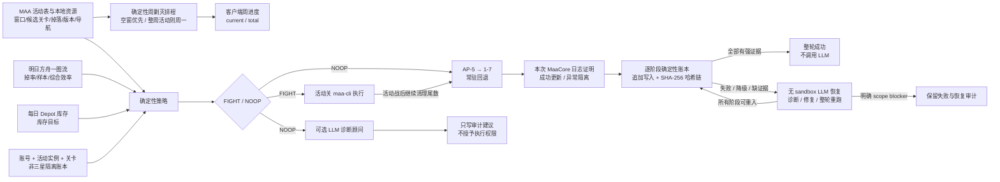

# 架构与执行契约

[文档索引](README.md) · [项目首页](../README.md)

说明确定性规划、执行链路及证据边界。日常操作见[运维手册](operations.md)。

## 架构与授权边界

各输入只承担单一职责：

| 输入 | 用途 | 不能授予的权限 |
|---|---|---|
| MAA `StageActivityV2` 与本地资源 | 提供活动半开时间窗口、候选关、目标材料、最低 MaaCore 版本，并确认本地资源能导航 | 不决定哪一关最值得刷 |
| 明日方舟一图流 | 提供关卡掉率、样本量、期望理智和综合效率 | 不证明活动已经开放，也不能加入 MAA 候选集之外的关卡 |
| 每日 Depot 扫描 | 提供当前游戏日的库存观测；经典材料按[库存策略](configuration.md#配置库存策略)换算蓝材料等价库存 | 未识别到的目标蓝材料是“未知”；下级材料缺失只是不计入，绝不虚构库存 |
| 能力账本 | 保存三星成功审计和本轮明确观测到的非三星隔离 | 不能替代客户端判断是否保存代理；缺少本地记录不是拒绝理由 |
| LLM 顾问 | 诊断上游结构变化和可能的关卡映射问题 | 不能把 `NOOP` 改成 `FIGHT`，不能登记代理能力 |
| LLM 恢复代理 | 只在阶段失败、降级、缺失或 launcher 非零退出时启动；优先修复并跑通完整流程，必要时自选本地分支提交修复并发 PR | 不能伪造成功、修改当前 scope/审计、合并 PR，或跨越 scope blocker |

外部来源仅允许预设 HTTPS 域名。响应有大小限制、严格 JSON/结构校验、重复键和非有限数拒绝、请求体身份、SHA-256、条件请求与原子缓存；网络失败时只接受 freshness 范围内且哈希仍一致的缓存。活动关窗口只取自结构化的 MAA `StageActivityV2`；不再请求鹰角公告、解析 HTML 或维护文案正则。

## 完整运行链路

默认顺序如下：

1. 用一次纯本地检查核对静态安全契约和 05:30 更新器写入的 runtime generation receipt；不会启动 MaaCore。receipt 与 live Core、资源、API cache 或受管任务配置不一致时整轮失败关闭。
2. 06:00 在缺少当前游戏日有效快照时，用一个原生 `startup = true` 的 MAA task 启动游戏并扫描 Depot；18:00 和已有有效快照的恢复重跑复用快照，不再扫描。以赤金 `150` 阈值确定无人机目标；快照有效期、缺失处理见[库存与无人机策略](configuration.md#基建无人机)。
3. 两个槽都运行同一份完整 daily（基建、普通公招、小车公招、信用商店）；daily 可重入，首次 attempt 未形成完整证明时直接重试一次，不受已有状态 marker 限制。
4. 每轮只联网刷新一次完整规划来源；18:00 与 06:00 使用同一路径。live MAA 资源仍只由独立的受控更新器写入。
5. 用本轮缓存离线计算本周剿灭窗口；到期时按单次代理事务执行，逐次读取客户端周进度，满额才登记完成。来源刷新失败不会在这个阶段再次轰炸同一端点。
6. 材料规划复用 daily 前校验过的每日 Depot 快照。已尝试但失败的 Depot 不会在同一轮重复；决策同样只离线校验并复用第 4 步缓存，不做第二轮网络刷新。
7. 仅当 JSON 为合法 `FIGHT` 且启动器二次校验有序候选的关卡码、活动实例、材料及临期药参数后，逐关执行零体力代理画面检查。
8. 零体力 preflight 只授权游戏已保存的代理，随后由 MaaCore 自动连战；同关本轮连续三次 Fight 调用失败才本轮隔离，前两次重试，成功重置。活动候选依序耗尽后才走 AP-5、1-7，完成状态须有新鲜尾数证据。
9. 若尚无新鲜、正常完成的低于 6 理智证明，依次尝试 `AP-5`、`1-7` 清理尾数。只有一场三星战斗但未清完时仍保留 `degraded` 并触发恢复，不能把运行时、导航或代理故障冒充成正常结束。
10. 无论前面的可选刷图是否成功，最后只运行独立的 `award-only`，领取普通任务奖励；它不能进入基建、公招、商店、邮件或战斗。
11. runtime、设备、Depot、daily、来源、剿灭、刷图、Award 和 cleanup 各写一个终态事件。`degraded`、`failed`、缺阶段或非零退出都会在清理设备后触发无 sandbox LLM 恢复；只有 controller 验证另一轮完整 run 全部 accepted 后，外层 service 才能转绿。

整轮编排只启动并持有一个 Waydroid 会话。各条 maa-cli 子命令复用同一个运行中的 Waydroid/ADB 设备；daily 和 award-only 都不负责关闭会话，启动器只在全部阶段结束或异常退出时统一清理一次。

启动器不会只凭 maa-cli 的退出码宣布成功：daily 日志必须恰有两次 `Infrast Start/Completed`、四次 `EnterFacility Dorm #`、两次 `Recruit Completed`，不得出现 `EnterFacility Training`，并包含 `Mall Completed` 与 `AllTasksCompleted`；最后的 award-only 独立日志必须包含 `Award Completed` 与 `AllTasksCompleted`，且不得出现 `Infrast`、`Recruit`、`Mall`、`Depot` 或 `Fight` 的开始/完成标记。统一入口固定使用 `INFO` 日志级别以保留这些证据。

游戏日统一定义为 `Asia/Shanghai` 当前时刻减四小时后的日期。定时槽的截止时间保证正常运行不会跨过 04:00；如果异常跨界，启动器会失败关闭，而不会在同一个 service 中再次执行基建、公招或商店。

## Fail-closed 条件

以下情况会拒绝相应活动候选或阻止活动 Fight 授权。进入候选执行后，不可用候选可转交后续候选及 `AP-5`、`1-7`；Depot、任务契约或决策执行校验失败也可能直接结束本轮刷图，不能保证总会回退。daily 位于刷图之前：

- 当前没有 MAA 活动，或进入活动结束前安全边界。
- 必需来源过期、不可用、结构异常、请求身份变化或缓存哈希失败。
- MAA 活动缺少合法最低版本，MaaCore 版本不足，或本地资源不能导航关卡。
- 一图流没有对应关卡/材料、样本不足，或数值异常。
- Depot 不完整、过期、属于其他命名空间，或目标材料未被观察到。
- 关卡已在本账号命名空间、本活动实例中被明确的非三星结果隔离。
- 零体力 preflight 未得到三个 Custom 按序完成、目标关选择及其后的 `UsePrtsSuccessCheck` 画面匹配证据；预检不要求或生成三星战斗证明。
- 决策 JSON 的 schema、关卡码、活动实例或执行参数未通过启动器二次校验。

## MAA Core 与资源一致性

`config/cli.toml` 固定 `resource.auto_update = false`，因为 maa-cli 的 Git 热更新会在 MAA 命令启动前直接改写 live overlay，无法先证明新资源与当前稳定 MaaCore 兼容。maa-cli 0.7.5 还会在每个任务前检查 API `tasks.json` 并最后覆盖同名 Core 任务；正式运行因此使用 `var/data/cache` 中已验证的快照，并把该快照的新鲜期设为 100 年，普通任务只装载而不联网换版。`var/cache/maa-runtime` 是指向该目录的兼容链接。项目的 `bin/zootd-maa` 会拒绝配置漂回 Git 自动更新，也会拒绝对 live 直接执行 `maa hot-update`、`install` 或 `update`。

这里并不停止 Core 或资源更新，而是把它们合并到 `./bin/zootd runtime-update`。更新器先在 `var/cache/maa-runtime-candidate.*` 复制当前代际，再用 maa-cli 安装最新 stable MaaCore 及其配套基础资源，同时取得最新 MaaResource 和 API tasks/活动表。候选按“最新 overlay/当前 overlay/仅基础资源”和“最新 API cache/当前 API cache”从新到旧组合，以候选 Core 对 daily、Award-only、剿灭、Depot、单进程代理 preflight 及两种 Fight 逐一 dry-run，并在提升前用候选代际实际生效的 `item_index.json` 核对蓝材料配方身份；选择第一个完整通过的组合。

Core 库、Core 基础资源、Git overlay 和 API cache 全部位于同一个 `var/data` 代际。通过候选使用 Linux 原子目录交换一次发布，随后再次验证；失败则用同一种原子交换恢复上一代。上一份完整 runtime 保存在 `var/cache/MaaRuntime.previous`。候选失败或网络不可用时不会接触 live；只要 live 自检仍通过，游戏 service 继续使用它。

每次完整验证成功后，更新器把 schema 3 generation receipt 原子写入 `var/state/runtime/maa-resource.json`。它密封 `var/data` 的文件身份/大小/时间 metadata、MaaCore 主库 SHA-256、API tasks 与活动表 SHA-256，以及真正参与候选 dry-run 的 `cli.toml`、任务、profile 和受保护宿舍配置摘要；`transition` 还保留当前代际启用时间及上一代 Core/resource 身份。规划目标、阈值等运行策略不被不必要地钉死，仍由每轮静态契约独立校验。18:00、06:00 和轻量 Award E2E 只重算并比较这份 receipt，再执行一次静态契约检查；它们不再逐项启动 MaaCore dry-run。更新器会在交换 live 前先写 `status = "promoting"`，因此中途掉电也不会让新旧代际被误认成已验证。旧 schema 2 receipt 只作为现有 live 的只读迁移桥接：必须匹配两份 hot-cache 哈希和全部静态契约；下一次 05:30 成功验证后自然升级为完整 schema 3。

05:30 `zootd-runtime-update.timer` 每天同时检查 stable Core 与官方 MaaResource `main`，所以不会因为资源暂时要求更高 Core 而永久钉死旧版。`./bin/zootd install-core`、`update` 和 `runtime-update` 都进入同一个事务式更新器；`resource-update` 只是旧命令的兼容别名。手工执行 `zootd-planner sync` 也只调用这个入口；正式游戏 service 已持有全局锁，所以仅刷新 HTTP 规划来源，不会在任务中途改 runtime。状态证据位于 `var/state/runtime/maa-resource.json`。

## 实验性 Operator Box 边界

独立 `box-login` / `box-sync` 入口位于 `maa_planner/box_cli.py`；Skland 的认证、签名、官服绑定、字段校验和错误分类集中在 `skland.py`，下游只消费 `operator_box.py` 的 `BoxProvider → OperatorBox`。凭据和原始玩家响应不进入 HTTP 公共缓存、普通日志或受管任务审计；只有最小规范快照落入本地状态目录。失败不会写出空 Box 代替错误。

技能使用 canonical ID，专精、模组等级和解锁状态保留未知值；名字、技能序号与模组类型需要后续静态数据映射。获取时间不意味着远端练度与客户端实时一致，静态匹配也不等于通关证明。Box 模块没有 matcher 或游戏执行能力；独立 `prts.py` / `prts_cli.py` 只提供显式 PRTS 候选查询与单份完整作业获取，以本机 MAA 关卡表进行两次身份复核。daily、planner、timer 与恢复 controller 均不调用这些实验模块。后续实验仍必须由用户显式触发，详见 [路线图](copilot/README.md)，登录与文件权限见[运维手册](operations.md#森空岛登录与-box-同步experimental)。
